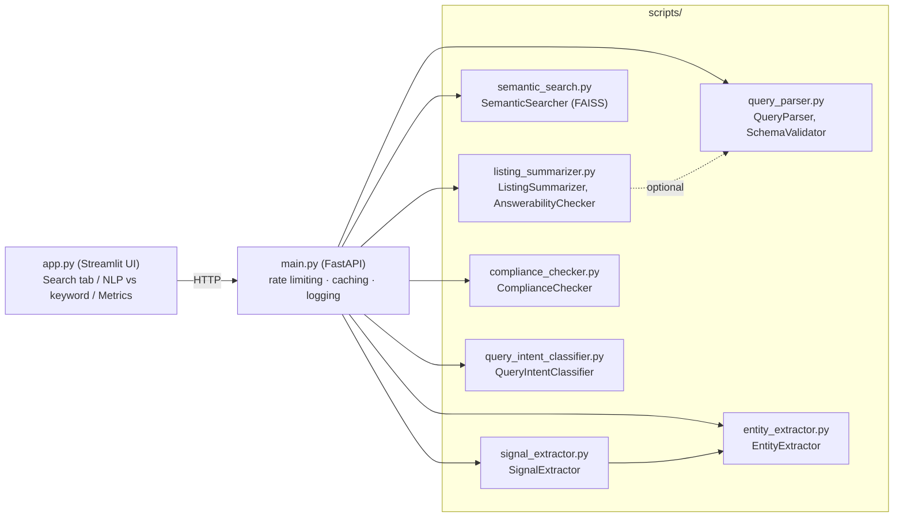

# Real Estate NLP Search

An NLP pipeline for real estate listings — query understanding, semantic
search, entity extraction, summarization, Fair Housing compliance
checking, and intent classification — exposed as a REST API with a demo
web UI on top.

## Architecture overview



**Design principle used throughout:** every NLP module is imported
*optionally* in `main.py`. If a module (or a heavy dependency like
`sentence-transformers`) isn't available in a given environment, its
endpoint returns a clear `503` instead of the whole API failing to
start. `GET /` shows exactly which modules are currently loaded.

### Request flow (a typical search)

1. `app.py` sends the raw query to `POST /parse-query` → `QueryParser`
   extracts structured filters (beds, price range, city, amenities...).
2. `app.py` sends the same query to `POST /classify-intent` →
   `QueryIntentClassifier` labels it browsing / researching /
   high-intent.
3. `app.py` sends the query to `POST /search` → `SemanticSearcher`
   (FAISS + sentence embeddings) ranks listings, filtered by the
   structured constraints from step 1.
4. For each result, `app.py` calls `POST /summarize` →
   `ListingSummarizer` produces a 2-3 sentence summary (beds/baths/price
   + top features + an extractive sentence from the remarks).
5. Before a listing description goes live, `POST /check-compliance` runs
   it through `ComplianceChecker` to flag Fair Housing Act violations.

## Repository layout

```
.
├── main.py                    # FastAPI app (the API)
├── app.py                     # Streamlit demo UI
├── scripts/
│   ├── query_parser.py
│   ├── entity_extractor.py
│   ├── signal_extractor.py
│   ├── semantic_search.py
│   ├── listing_summarizer.py
│   ├── compliance_checker.py
│   ├── query_intent_classifier.py
│   └── build_schema.py        # generates scripts/schema.json from a listings CSV
├── Dockerfile
├── requirements.txt
├── render.yaml                # Render.com deployment blueprint (2 services)
├── Procfile                   # generic Heroku/Railway-style start command
├── run_tests.sh               # runs the full suite with coverage
├── .coveragerc
└── demo_script.md             # timed script for the presentation video
```

## Setup instructions

### 1. Local development

```bash
git clone <your-repo-url>
cd <repo>
python3 -m venv venv
source venv/bin/activate          # Windows: venv\Scripts\activate
pip install -r requirements.txt
```

Run the API:
```bash
uvicorn main:app --reload
```
Visit `http://localhost:8000/docs` for interactive OpenAPI docs.

In a second terminal, run the UI:
```bash
streamlit run app.py
```
Visit `http://localhost:8501`. The sidebar's "API base URL" defaults to
`http://localhost:8000` (or whatever `API_URL` env var is set).

### 2. Generating your schema

If you're using your own listings data instead of the built-in demo
listings, generate `scripts/schema.json` from your CSV first:
```bash
python3 scripts/build_schema.py your_listings.csv scripts/schema.json
```
This is what `QueryParser`'s `SchemaValidator` uses to reject queries
referencing unknown cities/property types/amenities.

### 3. Docker

```bash
docker build -t real-estate-nlp .
docker run -p 8000:8000 real-estate-nlp
```
By default this runs the API (`main.py`). To run the UI in a container
instead, override the command:
```bash
docker run -p 8000:8000 real-estate-nlp \
    streamlit run app.py --server.port 8000 --server.address 0.0.0.0 --server.headless true
```

### 4. Deployment (Render, free tier)

This needs **two separate services** from the same repo — one running
the API, one running the UI. They are two different long-running
processes; a single service can only run one start command.

Using `render.yaml` (Blueprint deploy): Render dashboard → **New →
Blueprint** → select this repo. It defines both services with their
correct start commands.

Deploying manually instead: create two **Web Services** pointed at the
same repo, and set each one's **Docker Command** explicitly (don't rely
on the Dockerfile's default `CMD` — if you ever change it for one
service, it silently changes for both unless each has its own explicit
override):
- API service: `uvicorn main:app --host 0.0.0.0 --port 8000`
- UI service: `streamlit run app.py --server.port 8000 --server.address 0.0.0.0 --server.headless true`

Then set an `API_URL` environment variable on the **UI service**
pointing at the API service's URL (e.g.
`https://your-api-name.onrender.com`), so the UI knows where to send
requests by default.

**Free tier notes:**
- Services spin down after ~15 min idle; the next request takes 30-60s
  to wake up.
- The *first* `/search` call after any restart is slow (can exceed 60s)
  because it lazily loads the sentence-transformers model and builds
  the FAISS index. Every call after that is fast. `app.py` uses a 90s
  timeout on search specifically to accommodate this.
- `requirements.txt`/`Dockerfile` install a CPU-only PyTorch build
  explicitly (`--index-url https://download.pytorch.org/whl/cpu`
  before installing the rest) — without this, `sentence-transformers`
  pulls the default CUDA build, adding ~2GB of completely unused GPU
  libraries to the image on a host with no GPU.

## Testing & coverage

Every module's tests are embedded directly in that module (run the file
itself, or point pytest at it) rather than in separate `test_*.py`
files.

Run everything with coverage:
```bash
bash run_tests.sh
```
or directly:
```bash
pytest --cov=. --cov-report=term-missing \
    scripts/query_parser.py scripts/entity_extractor.py scripts/signal_extractor.py \
    scripts/listing_summarizer.py scripts/compliance_checker.py \
    scripts/query_intent_classifier.py scripts/semantic_search.py \
    main.py app.py
```

**Note:** pytest only auto-discovers tests in `test_*.py`-named files
when pointed at a directory. Since tests live inside e.g.
`query_parser.py` rather than a separate `test_query_parser.py`, each
file must be listed explicitly (as `run_tests.sh` does) — pointing
pytest at `scripts/` alone will silently skip all of them.

**Last measured result: 88% overall coverage, 79 tests passing.**

| File | Coverage |
|---|---|
| `query_intent_classifier.py` | 100% |
| `semantic_search.py` | 100% |
| `compliance_checker.py` | 98% |
| `listing_summarizer.py` | 95% |
| `signal_extractor.py` | 95% |
| `query_parser.py` | 86% |
| `entity_extractor.py` | 80% |
| `main.py` | 91% |
| `app.py` | 56% |

`app.py` sits below the others honestly: its remaining uncovered lines
are UI rendering branches inside Streamlit button-click handlers, which
`streamlit.testing.v1.AppTest` can simulate for widget presence but not
fully exercise without driving a real browser session end-to-end. The
core logic it depends on (`call_api`, `naive_keyword_search`) is fully
covered; what's untested is presentation glue, not business logic.

## Known limitations

- **`SemanticSearcher` needs internet access** to download the
  `sentence-transformers` model on first use. If that's unavailable,
  `/search` returns a `503` rather than silently failing.
- **`QueryIntentClassifier`'s training data is a small, template-
  generated synthetic set** (~215 queries) plus a 15-query hand-labeled
  eval set — see the limitations note at the top of
  `query_intent_classifier.py` for the full caveat on language-only
  intent inference.
- **`ComplianceChecker` is a pattern-matching first pass**, not a legal
  compliance guarantee — see the documentation block at the top of
  `compliance_checker.py` for what it does and doesn't catch.
- **Rate limiting and caching are in-process** (per-instance token
  bucket / in-memory dict). For a multi-instance deployment, swap the
  cache for Redis (already supported via `REDIS_URL`) and the rate
  limiter for a shared store.